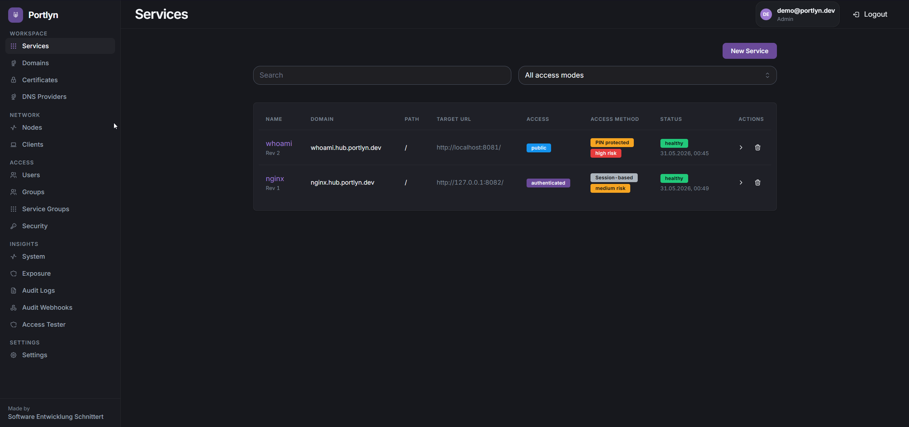
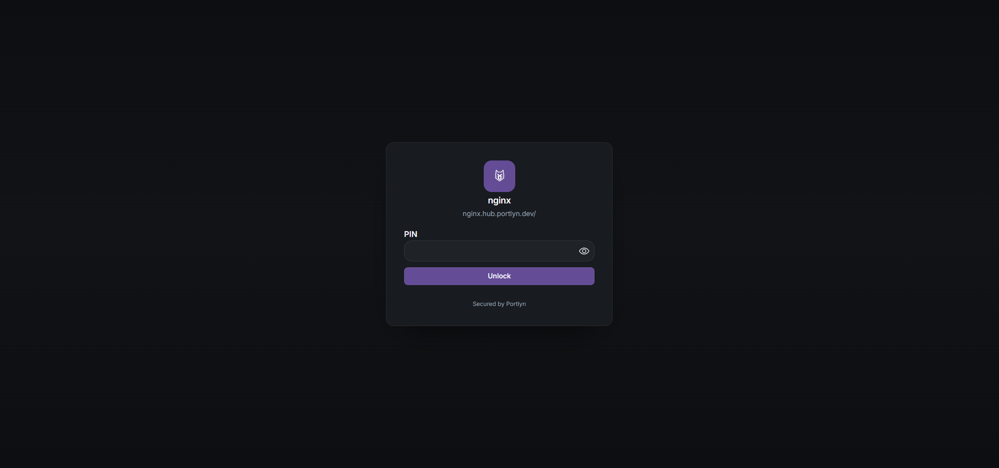
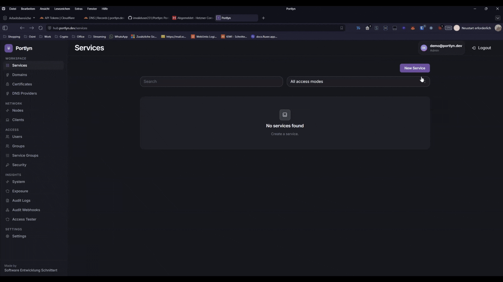
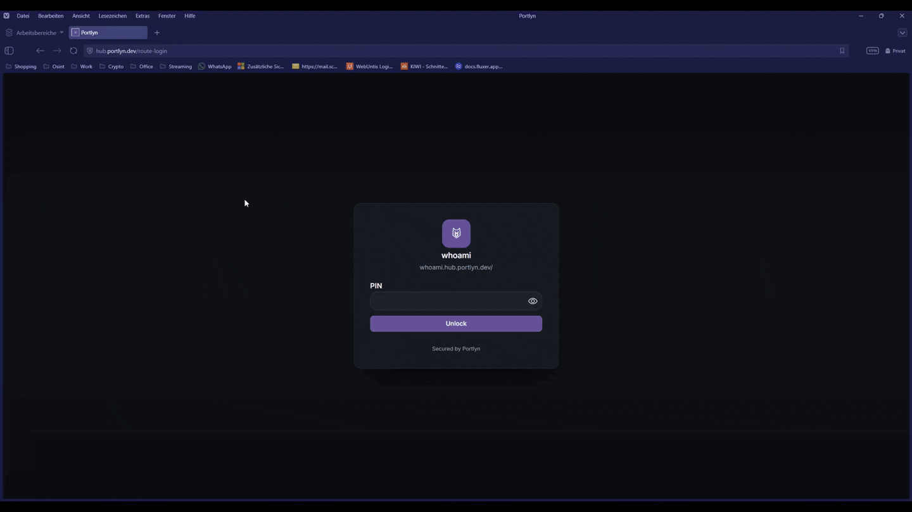
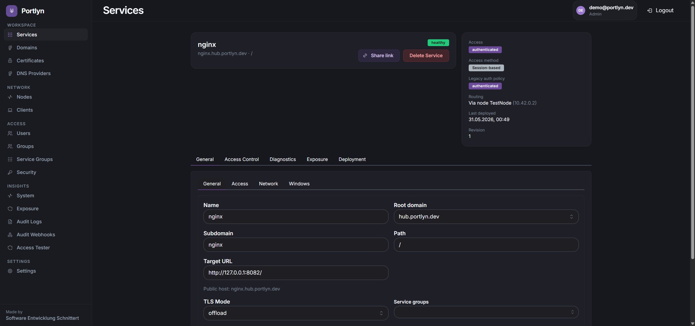
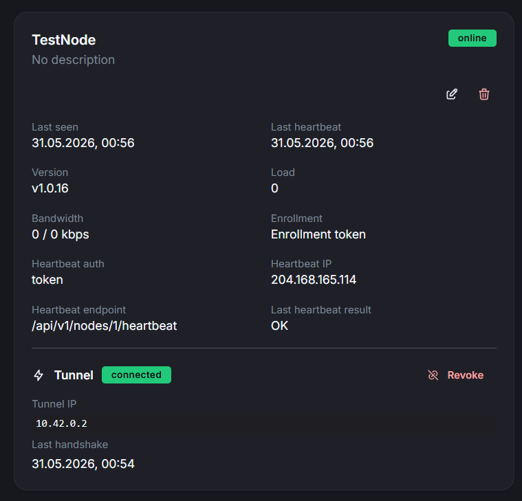
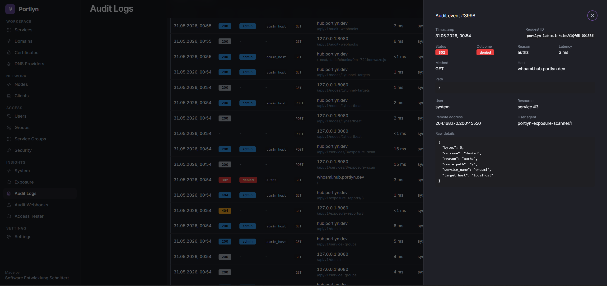

<p align="center">
  
</p>

<h1 align="center">Portlyn</h1>

<p align="center">
  An identity aware reverse proxy with a built in WireGuard tunnel.<br />
  A self hosted Go hub for TLS, per route authentication, and routing,
  plus an optional node agent for machines behind NAT or CGNAT.
</p>

<p align="center">
  <a href="https://github.com/portlyn/Portlyn/actions/workflows/ci.yml"></a>
  <a href="https://github.com/portlyn/Portlyn/releases"></a>
  
  <a href="LICENSE"></a>
</p>

<p align="center">
  <a href="#overview">Overview</a> ·
  <a href="#features">Features</a> ·
  <a href="#installation">Installation</a> ·
  <a href="#use-cases">Use cases</a> ·
  <a href="docs/">Documentation</a> ·
  <a href="SECURITY.md">Security</a>
</p>

<p align="center">
  
  
</p>

<p align="center">
  
</p>

## Overview

Portlyn is a self hosted reverse proxy that combines routing, TLS, identity, and a WireGuard tunnel in a single Go binary. It exposes private services on your own domain over HTTPS, gates them with the authentication method that fits each route, and can reach machines behind NAT or CGNAT through an embedded userspace tunnel.

It is built for homelabs and small teams that want one process instead of stitching together Traefik, Authelia or Authentik, Crowdsec, and WireGuard separately. Configuration lives in an admin UI; routes, identity providers, certificates, nodes, and audit are all first class resources.

The hub runs as a standalone binary on a Linux host or as a Docker Compose stack with PostgreSQL, Loki, Alloy, and Grafana. The node agent is a separate small binary that dials out to the hub over WireGuard, so the machines behind the firewall never listen for inbound traffic.

## Features

### Routing and access control

- Per service routes by domain and path
- Access modes: `public`, `authenticated`, `restricted`
- Access methods per route: session, OIDC SSO, PIN, email code, magic link
- User groups and service groups for reusable policy
- Access windows with timezone aware weekday and time ranges
- IP allow and block lists, GeoIP allow and block lists per service
- CrowdSec LAPI integration with periodic decisions pull

### Identity

- Local password authentication with bcrypt
- OIDC SSO with role claim mapping and allowed email domains
- TOTP MFA with recovery codes
- WebAuthn passkeys parallel to TOTP, registration and login
- Magic link sharing per service for one off access without an account
- Email code based one time passwords for routes that do not require accounts
- Optional mandatory MFA for admins with a bootstrap wizard that cannot be skipped before enrollment

### Certificates

- ACME with HTTP-01 and DNS-01 challenges
- Wildcard certificates through DNS-01
- DNS providers: Cloudflare, Hetzner DNS, AWS Route 53, DigitalOcean DNS
- Multi SAN issuance, Let's Encrypt production and staging
- Automatic renewal, manual renew, retry, sync status, PEM import
- DNS provider credentials encrypted at rest with AES-256-GCM and Argon2id derived keys

### Tunnel

- Userspace WireGuard server in the same process, backed by `wireguard-go` and gVisor netstack
- No kernel module and no `wg-quick` glue. The tunnel itself runs in userspace; binding privileged ports may still need root, Linux capabilities, or a fronting proxy depending on the deployment
- Per node WireGuard keypairs that never leave the node, enrollment via single use tokens
- Per service routing through a tunnel node by setting `node_id` on the service
- Subnet routing so a node can advertise LAN subnets that the mesh can reach
- Roaming clients with a WireGuard config and QR code for the official WireGuard app

### Audit and operations

- Hash chained audit log with previous hash verification
- Webhook fan out to Slack, Discord, ntfy, and generic JSON, signed with HMAC-SHA256
- Per service exposure scanner with DNS, TLS, header, redirect, and auth posture checks
- Access tester and per request decision trace for troubleshooting policy denials

### Supply chain

- Releases are built from GitHub Actions and signed with Cosign keyless via Sigstore
- Self update verifies the SHA-256 checksum and the full Sigstore certificate chain through sigstore-go against an embedded TUF trust root before atomic swap
- No telemetry, no analytics SDK, no automatic update checks

## Installation

One line install on Linux (downloads, verifies checksum + Cosign signature, creates a system user, installs the systemd unit):

```bash
curl -fsSL https://raw.githubusercontent.com/portlyn/Portlyn/main/scripts/install-hub.sh \
  | sudo PORTLYN_DOMAIN=portlyn.example.com PORTLYN_ADMIN_EMAIL=admin@example.com sh
```

Or install the single binary manually:

```bash
curl -L https://github.com/portlyn/Portlyn/releases/latest/download/portlyn-linux-amd64 -o portlyn
chmod +x portlyn
sudo mv portlyn /usr/local/bin/portlyn
sudo portlyn init
sudo portlyn
```

`portlyn init` generates secrets, writes a `.env` file, prepares the data directory, and creates the admin account. Use `portlyn init --non-interactive` for scripted installs, and `portlyn doctor` to validate the whole environment in one pass.

Just want to try it locally (no domain, no TLS, no root)? `PORTLYN_DOMAIN=localhost ./portlyn init --non-interactive && ./portlyn` → dashboard on `http://localhost:8000`.

For production installs, verify the SHA-256 checksum and the Sigstore signature of the binary before running it. The full verification procedure is in [docs/INSTALL.md](docs/INSTALL.md).

Docker Compose with the published image:

```bash
git clone https://github.com/portlyn/Portlyn.git
cd Portlyn
cp .env.docker.example .env.docker
# edit secrets and admin credentials in .env.docker
docker compose --env-file .env.docker up -d
```

The Compose stack pulls `ghcr.io/portlyn/portlyn:latest` by default. Pin a specific tag with `PORTLYN_IMAGE_TAG=v1.2.3`. If the pull is denied because the GHCR packages are private, `docker login ghcr.io` or build locally with the dev overlay (`-f docker-compose.yml -f docker-compose.dev.yml up -d --build`).

Detailed steps for release verification with Cosign, node agent enrollment, configuration, and the production checklist are in [docs/INSTALL.md](docs/INSTALL.md).

## Use cases

- **Expose a homelab service on your own domain** without opening inbound ports. A node agent on the home machine dials the hub on a VPS; the hub terminates TLS and forwards traffic through the tunnel.
- **Put authentication in front of any internal tool**, whether or not it has its own login. A PIN or one time email code is enough for low friction sharing; OIDC SSO and passkey based MFA cover the admin and team cases.
- **Simplify smaller self hosted setups** that would otherwise need Traefik, Authelia or Authentik, and WireGuard as separate components plus their glue.

## What Portlyn is not

- Not a CDN and not protection against volumetric L3/L4 DDoS
- Not a Web Application Firewall; it does not inspect request bodies
- Not multi tenant; all admins see all services
- Not a mature HA edge cluster yet; a single hub today
- Not a replacement for fixing vulnerable upstream applications

## Screenshots

<p align="center">
  
</p>

<p align="center">
  
  
</p>

<p align="center">
  
</p>

## Documentation

- [Installation and configuration](docs/INSTALL.md)
- [Production hardening](docs/PRODUCTION-HARDENING.md)
- [Security policy and threat model](SECURITY.md)
- [Release process](docs/RELEASE.md)
- [Backup and restore](docs/BACKUP-RESTORE.md)
- [HA deployment notes](docs/HA-DEPLOYMENT.md)
- [Secret rotation](docs/SECRET-ROTATION.md)
- [Break glass recovery](docs/RECOVERY-BREAKGLASS.md)
- [OpenAPI specification](openapi.yaml)
- [Changelog](CHANGELOG.md)

## Contributing

Issues, PRs, and discussions are welcome. See [CONTRIBUTING.md](CONTRIBUTING.md) and the [Code of Conduct](CODE_OF_CONDUCT.md). To report a vulnerability privately, see [SECURITY.md](SECURITY.md).

## License

Portlyn is released under the [MIT License](LICENSE). See [LICENSING.md](LICENSING.md) for details.
